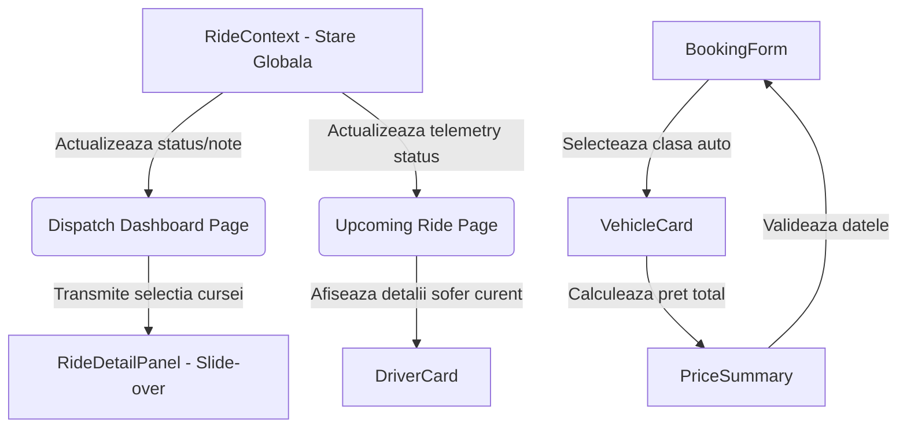

# Noirride-# NoirRide — Executive Transfer Booking & Dispatch Portal

A high-performance, polished frontend prototype built for **NoirRide**, a fictional premium chauffeur and executive transfer dispatch company. Designed with a meticulous restrained luxury aesthetic, high-contrast obsidian and champagne gold styling, mobile-first customer flows, and a desktop-first operational command dashboard.

---

## 💎 Architecture & Engineering Highlights

This prototype strictly separates business logic, mock data layers, and UI components following modern React + TypeScript architecture best practices:

```
src/
├── components/
│   ├── booking/        # Customer booking specific components
│   │   ├── BookingForm.tsx
│   │   ├── DriverCard.tsx
│   │   ├── PriceSummary.tsx
│   │   ├── TripTimeline.tsx
│   │   └── VehicleCard.tsx
│   ├── dashboard/      # Operator dispatch dashboard components
│   │   ├── FilterBar.tsx
│   │   ├── RideDetailPanel.tsx
│   │   ├── RideStatusBadge.tsx
│   │   ├── RidesTable.tsx
│   │   └── StatsCard.tsx
│   ├── layout/         # Core navigation & top-level layout
│   │   └── Navbar.tsx
│   └── ui/             # Reusable design system primitives
│       ├── Badge.tsx
│       ├── Button.tsx
│       ├── Card.tsx
│       ├── EmptyState.tsx
│       ├── Input.tsx
│       ├── LoadingState.tsx
│       ├── Modal.tsx
│       └── Select.tsx
├── context/
│   └── RideContext.tsx # Unified reactive state manager (localStorage sync)
├── data/               # Strictly decoupled mock datasets
│   ├── drivers.ts      # Vetted chauffeur dossiers
│   ├── rides.ts        # 12+ detailed operational dispatch records
│   └── vehicles.ts     # 4 executive fleet classes with capacities & rates
├── hooks/              # Custom encapsulated hooks
│   ├── useBooking.ts   # Multi-step booking flow & validation state
│   └── useRideFilters.ts # Dispatch searching, filtering, sorting & KPIs
├── pages/
│   ├── customer/       # Customer-facing surface screens (Mobile-first)
│   │   ├── BookRidePage.tsx
│   │   ├── BookingReviewPage.tsx
│   │   ├── UpcomingRidePage.tsx
│   │   └── VehicleSelectPage.tsx
│   └── dashboard/      # Operator command center (Desktop-first)
│       └── DispatchDashboardPage.tsx
├── types/
│   └── index.ts        # Core TypeScript interfaces & status unions
├── App.tsx             # Route configuration & Provider wrapper
└── main.tsx            # Application entrypoint
```

---

## 🚀 Quick Start Setup

### Prerequisites
* **Node.js** v18+ 
* **npm** v9+

### Installation & Development

1. **Clone & enter project directory:**
   ```bash
   git clone <repository-url> noir-ride
   cd noir-ride
   ```

2. **Install dependencies:**
   ```bash
   npm install
   ```

3. **Launch the development server:**
   ```bash
   npm run dev
   ```
   Open your browser to `http://localhost:5173/` to explore the application.

4. **Production Build & Verification:**
   ```bash
   npm run build
   ```

---

## 🌟 Key Features & Surfaces

### 1. Customer Booking Surface (Mobile-First & Responsive)
*   **Homepage / Căutare Directă:** Utilizatorul introduce destinația dorită direct în bara de căutare principală ("Where to?"). La finalul inputului se află un selector predefinit pe "Now" (pentru curse imediate) ce listează opțiunile de preluare (Now, In 15 min, In 30 min, In 1 hour, Custom Time).
*   **Popup pentru Preluare:** După trimiterea destinației din homepage, un popup modal cu același stil de căutare solicită introducerea locației de preluare (Pickup Location) înainte de a trece la selecția flotei.
*   **Principiul de Tunneling:** Pagina de pornire conține carduri dedicate pentru protocoalele specifice (*Airport Transfer*, *Hourly As Directed*, *Intercity Voyage*). La apăsarea oricăreia dintre ele, se deschide o secvență de pop-up-uri care solicită destinația și locația de preluare într-un flux ghidat.
*   **Vehicle Selection:** Compară patru clase de flotă distincte (*Business Sedan*, *Premium SUV*, *Luxury Van*, *Executive Class*) cu preț calculat live, detalii despre capacități (pasageri/bagaje) și dotări premium.
* **Booking Review & Validation:** Real-time validation for executive credentials, itemized guaranteed fee breakdown (base, wait protocol, taxes), secure loading simulation, and confirmation workflow.
* **Upcoming Ride Telemetry:** Live status timeline (*Scheduled → En Route → Arrived → In Progress → Completed*), real-time ETA notification (*"Driver arriving in 8 min"*), chauffeur dossier card with direct line simulation, and zero-fee termination modal.

### 2. Operator Dispatch Dashboard (Desktop-First Operations Command)
* **Real-time KPI Overview:** Instant metrics for total operations today, active transfers, scheduled dossiers, terminated orders, and guaranteed daily revenue alongside a compact activity feed.
* **Operational Manifest Table:** Inspect 12+ pre-configured mock bookings with color-coded status badges and quick action triggers.
* **Instant Filtering, Search & Sorting:** Filter by 6 operational status states, perform fuzzy search across passenger names, chauffeurs, or dossier IDs, and sort ascending/descending by time or fare. Includes empty states with reset triggers.
* **Slide-Over Inspection Drawer:** Click any dossier row to inspect passenger VIP credentials, route specifications, assigned fleet asset, live telemetry progress, and edit internal notes with instant reactive status switches.


## 🎨 1. Conceptul Vizual: Lux Discret & Contrast Înalt

NoirRide utilizează un design dual contrastant bazat pe un sistem ierarhic de adâncime:
- **Fundalul Principal:** Un obsidian profund (`#030406`) care oferă o atmosferă selectă, premium, pe fundalul căruia plutesc stele simulate cu sclipiri pulsatorii.
- **Suprafețele Interactive (Carduri & Dashboard):** Un ton cald de fildeș (Bone White/Cream, `#f8f8def5`) care plasează informațiile importante într-o zonă de contrast ridicat pentru lizibilitate maximă și confort vizual în timpul operațiunilor de dispecerat.
- **Accentele:** Aur champagne folosit strategic pentru a ghida atenția actorilor umani asupra elementelor active, butoanelor principale de apel la acțiune (CTA) și selecției de vehicule premium.
- **Accesibilitate pe Mobil (Evitarea Suprastimulării):** Pentru ecranele mici de mobil, titlul paginii de pornire, subtitlurile și badge-urile decorative sunt complet ascunse (`hidden md:block`/`hidden md:inline-flex`), oferind direct formularul de căutare curat. Titlul principal este vizibil exclusiv pe desktop.

---

## 🎨 2. Paleta de Culori (Color Tokens)

Toate culorile sunt definite ca variabile CSS în [index.css](file:///c:/Users/sergi/OneDrive/Desktop/10%20proiecte/11-noir-ride/src/index.css) pentru o consistență deplină:

### A. Culori Brand & Accente (Aur Champagne)
| Variabilă CSS | Culoare Hex / RGBA | Utilizare |
| :--- | :--- | :--- |
| `--accent-gold` | #C08A2E` | Culoarea principală de accent, selectări active. |
| `--accent-gold-light` | #C28840` | Starea de hover pentru elementele de accent. |
| `--accent-gold-dim` | `rgba(192, 138, 46, 0.12)` | Fundaluri estompate, selecții de butoane active. |
| `--accent-gold-border`| `rgba(192, 138, 46, 0.35)` | Margini subtile aurii pentru vehicule sau carduri selectate. |

### B. Fundaluri & Suprafețe (Obsidian & Bone White)
| Variabilă CSS | Culoare Hex | Utilizare |
| :--- | :--- | :--- |
| `--bg-obsidian` | #030406` | Fundalul întregului site (body). |
| `--bg-surface` | #f8f8def5` | Fildeș/Bone White folosit pentru cardurile clienților și containerele dashboard-ului. |
| `--bg-surface-elevated`| #efeecb` | Versiune ușor mai închisă de fildeș pentru inputuri, dropdown-uri și sub-carduri. |
| `--bg-surface-hover` | #e8e8c1` | Starea de hover pentru suprafețele elevated sau dropdown-uri. |

### C. Culori Text
| Variabilă CSS | Culoare Hex | Utilizare |
| :--- | :--- | :--- |
| `--text-primary` | #0A0B0E` | Text principal închis la culoare, plasat pe suprafețe Bone White. |
| `--text-secondary` | #242b35` | Text secundar sau label-uri pe suprafețe Bone White. |
| `--text-muted` | #535a64` | Text estompat pentru descrieri sau detalii secundare. |
| `--text-light-primary` | #F8FAFC` | Text alb premium plasat direct pe fundalul obsidian. |
| `--text-light-secondary`| #94A3B8` | Subtitluri și descrieri plasate direct pe fundalul obsidian. |
| `--text-light-muted` | #64748B` | Text mic sau timestamps plasate direct pe fundalul obsidian. |

### D. Status & Telemetrie
Reprezintă vizual progresul cursei și starea șoferilor:
- 🟢 **Active / În Curs:** Emerald/Teal ( #10B981` /  #0D9488` | Fundal: `rgba(16, 185, 129, 0.12)`)
- 🟡 **Pending / Programat:** Amber ( #F59E0B` | Fundal: `rgba(245, 158, 11, 0.12)`)
- 🔵 **Completed / Finalizat:** Blue ( #3B82F6` | Fundal: `rgba(59, 130, 246, 0.12)`)
- 🔴 **Cancelled / Anulat:** Red ( #EF4444` | Fundal: `rgba(239, 68, 68, 0.12)`)

---

## 🔤 3. Tipografie (Typography)

Sistemul combină două fonturi Google Fonts distincte care se completează reciproc pentru o estetică editorială:

- **Cinzel (Serif):** 
  - Utilizat exclusiv pentru branding, titluri de secțiuni majore, logouri și elemente de identitate care necesită un aspect luxury, clasic.
  - Activabil prin clasa `.font-serif`.
- **Outfit (Sans-serif):**
  - Utilizat pentru corpul textului, formularul de rezervare, interfața dashboard-ului și tabele. Oferă o claritate excepțională și un aspect modern, minimalist.

---

## 🔗 4. Conectivitatea Componentelor (Component Topology)

Componentele NoirRide nu funcționează izolat; ele sunt strâns legate prin fluxuri de date reactive și feedback-uri vizuale complementare:



1. **Interacțiunea dintre `VehicleCard` și `PriceSummary`:**
   - Atunci când utilizatorul selectează un vehicul, clasa acestuia trimite tariful de bază către starea locală a formularului.
   - `PriceSummary` interceptează această stare și adaugă taxele specifice protocolului selectat (ex. Airport fee de $15, Wait Protocol sau taxe locale) pentru a calcula totalul garantat, care se reflectă imediat în butonul principal de rezervare.
2. **Conectivitatea dintre `RidesTable` și `RideDetailPanel`:**
   - Tabelul manifestului trimite obiectul cursei selectate către panoul lateral.
   - Orice modificare a notelor interne sau a stării cursei din `RideDetailPanel` se sincronizează prin intermediul `RideContext` (cu salvare în `localStorage`), provocând o re-randare reactivă imediată a rândului corespunzător din tabel și a badge-ului de status aferent.

3. **PRINCIPIUL DE TUNNELING PE HOMEPAGE (Mobile & Desktop):**

**IMPORTANT** 
   - Homepage-ul conține 3 carduri principale de servicii care ies in evidenta pe parcursul scrolling-ului  (*Airport Transfer*, *Hourly As Directed*, *Intercity Voyage*). La apăsarea oricăruia dintre ele, se inițiază un flux de „tunneling” printr-un popup modal la fiecare. Se vor adauga mai multe elemente vizuale pe acest principiu pentru divertismentul utilizatorului. Aceste modificari vor fi facute in concordanta cu dezvoltarea featurilor aplicatiei si investigarea utilizatorului mai indetaliata (Daca nu este conectat cu un cont ii sugeram sa se conecteze, diverse carduri in care explicitam featurile de loialitate sau ce avantaje ar putea sa mai aiba sau recomandari pe baza locatiei? Acestea sunt niste simple exemple)
   - **Pasul 1 (Destinație):** Solicită adresa de destinație (`Where to?`) și timpul de preluare (Now / Scheduled).
   - **Pasul 2 (Preluare):** Se actualizează automat pentru a cere adresa de preluare (`Pickup Location`), direcționând ulterior utilizatorul către alegerea clasei auto.

---

## 🧱 5. Descrieri Detaliate ale Componentelor de Bază

### A. Bara de Căutare Partajată (`SearchBar.tsx`) [NEW]
O componentă încapsulată și reutilizabilă care gestionează toate punctele de intrare pentru căutări:
- **Design integrat:** Conține câmpul text de input, o pictogramă personalizabilă (Navigation/MapPin) și un buton de acțiune.
- **Selector de timp intern:** La capătul din dreapta al input-ului (dar retras față de margine și separat prin `border-l`), găzduiește un meniu dropdown pentru ora de preluare, predefinit pe `"Now"`.
- **Reutilizare:** Este partajat între bara principală a paginii de pornire, popup-ul de preluare și modalul fluxurilor de tunelare a serviciilor.

### B. Cardul de Vehicul (`VehicleCard.tsx`)
Conceput pentru a prezenta flota executivă, acest card are un comportament adaptiv:
- **Fallback în caz de eroare de imagine:** Dacă link-ul către imaginea mașinii eșuează sau nu se încarcă din rețea, o stare internă reactivă (`imageError`) înlocuiește imaginea cu o pictogramă elegantă `<Car />` pe un fundal auriu estompat, păstrând aspectul premium.
- **Efectul Selectat:** Când este selectat, cardul trece la fundalul ridicat (`#1A1D28`), capătă o bordură strălucitoare auriu champagne (`#D4AF37`) și afișează o bifă de confirmare în colțul din dreapta-sus, oferind un feedback tactil vizual.
- **Detaliile de capacitate:** Sub numele clasei sunt integrate micro-tag-uri pentru numărul maxim de pasageri și bagaje permis, prevenind erorile de rezervare.

### C. Cardul de Șofer (`DriverCard.tsx`)
Reprezintă dosarul public al șoferului desemnat pentru o cursă activă sau viitoare:
- **Securitate & Acreditare:** Afișează un badge de siguranță `Vetted & Uniformed` cu o pictogramă `<Shield />` de culoare verde smarald, sporind încrederea clientului VIP.
- **Interacțiune simulată:** Dispune de butoane pentru *Direct Line* (linie securizată criptată) și *Dispatch SMS* (dossier prioritar). La apăsarea acestora, un banner temporar apare deasupra cardului cu un efect de tranziție lină (`animate-fade-in`), confirmând acțiunea de comunicare.
- **Elemente de prestigiu:** Rating-ul de 4.99 și numărul de curse (peste 1400) sunt evidențiate cu o stea aurie complet colorată (`fill-current`).

### D. Insignele de Status (`Badge.tsx` & `RideStatusBadge.tsx`)
Folosite pentru a cataloga cursele în dashboard și ecranele clienților:
- Au margini fine semi-transparente de 30% din culoarea de bază a statusului pentru a crea adâncime.
- Suportă un indicator circular pulsatoriu (`dot={true}`) realizat prin animația `@keyframes pulse`, menit să semnalizeze vizual că activitatea cursei respective este în desfășurare în timp real (ex. pentru statusul `En Route` sau `Arrived`).

---

## 💤 6. Designul Stărilor Inactive & Actorilor de Repaus (Idle States)

Un sistem de design complet acoperă scenariile în care nu există date active sau utilizatorul/actorii sistemului nu efectuează nicio acțiune directă:

### 1. Actori Inactivi (Idle Actors - Șoferi & Vehicule în Repaus)
- **Șoferi în Așteptare (Idle Chauffeurs):** În baza de date și în panouri, șoferii care nu se află în noul traseu sunt marcați ca având disponibilitate activă. Aceștia sunt listați cu ratingul lor istoric, dar fără asocieri de traseu curente, pregătiți pentru preluare instantanee.
- **Vehicule în Repaus (Idle Fleet Assets):** Vehiculele care nu sunt rezervate sunt prezentate în selecție cu tariful lor standard (calculat la minut/oră) și dotările lor implicite, așteptând ca actorul client să configureze traseul.

### 2. Stări Inactive ale Sistemului (`EmptyState.tsx`)
Atunci când interfețele nu au date de afișat (de exemplu, căutări fără rezultate în tabelul dispeceratului sau lipsa curselor planificate):
- **Tratament Vizual:** În loc de tabele goale sau ecrane albe, sistemul randează componenta `EmptyState` care conține:
  - O pictogramă reprezentativă (`SearchSlash` sau o altă alertă) plasată într-un cerc cu fundal translucid (`bg-white/5`).
  - Un titlu scris cu fontul serif `Cinzel` (ex. *"No Dispatch Records Found"*).
  - Un text explicativ de contrast mediu care îi oferă utilizatorului context despre motivul absenței datelor.
  - Un buton de resetare sau de apelare rapidă (ex. *"Reset Operational Filters"* sau *"Book a Ride"*) proiectat cu varianta de buton `outline` pentru a nu concura cu butoanele primare ale aplicației.

### 3. Simularea Timpului Inactiv (Background Dispatch Wait States)
- Atunci când clientul trimite o rezervare, sistemul intră într-o stare de așteptare simulată (Loading Simulator) cu o bară de progres aurie. Aceasta simulează timpul necesar ca un dispecer sau un șofer inactiv să preia comanda.
- Statusul inițial al cursei este setat pe `Scheduled` (Pending), reprezentând starea pasivă de așteptare din care cursa va fi activată ulterior în mod automat de simulatorul de telemetrie.

---

## ⚡ 7. Animații & Micro-interacțiuni

Pentru ca portalul să pară organic și animat:
- **`fadeIn` (`.animate-fade-in`):** Animație de 350ms care aduce elementele din opacitate zero și le deplasează ușor în sus pentru o tranziție lină.
- **`pulseSubtle` (`.animate-pulse-subtle`):** O pulsație extrem de discretă a dimensiunii și opacității (2.5 secunde) folosită pentru butoane interactive cheie sau elemente de status.
- **`bgPulseSeconds` (`.animate-bg-pulse-seconds`):** Efect de sclipire pentru stelele de pe fundalul obsidian.
